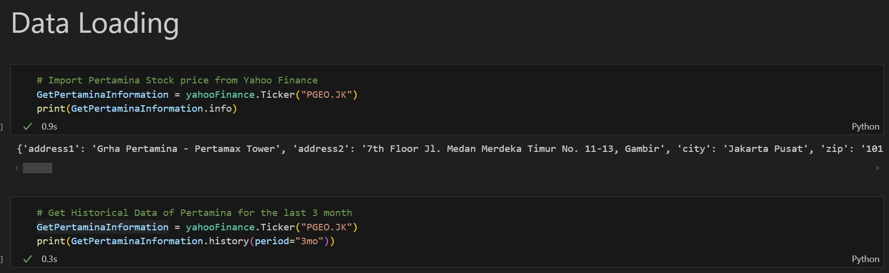

# Pertamina-Stock-Prediction
In this project, I am developing an advanced Prediction Analysis using Machine Learning to evaluate Pertamina's future stock performance by using time-series analysis techniques to gain insights into Pertamina's stock price trends and market behavior.

# How to Predict the Model
1. Download and open the file named Predict_Stock_Pertamina.ipynb

2. In the Data Loading Page you can change Ticker Symbol if you want to change the company to predict (exaple in the code is Pertamina's which is PGEO.JK)

   
3. Navigate to the Inference Part similar to the picture below

4. Change the code 'steps' in (forecast = arima.forecast(steps=12) and forecast_results = arima.get_forecast(steps=12)) depending on the forecasting duration (example in the code is 12)

5. You can also change the code (forecast['2024-09-20':]) and input your own date if you want to predict a specific date (example in the code is 2024-09-20)

6. Restart and run the code again
